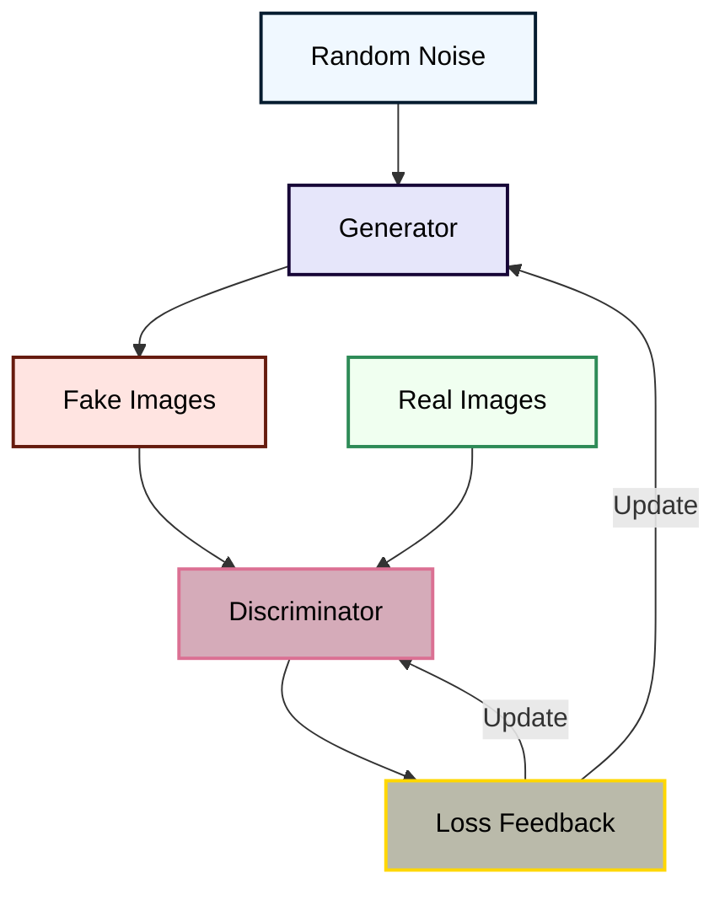

  <h1 style="font-size: 8em; font-weight: 900; background: linear-gradient(45deg, #FFD700, #DB7093, #051C2F); -webkit-background-clip: text; color: transparent; text-shadow: 2px 2px 8px rgba(0,0,0,0.2); margin-bottom: 0;">
   Generative Adversarial Networks (GANs) 
  </h1>
  
Generative Adversarial Networks (GANs) were introduced by Ian Goodfellow and his colleagues in 2014. GANs are a class of neural networks that autonomously learn patterns in the input data to generate new examples resembling the original dataset.

  

  
  

    
    
    
  

# Medical Image Synthesis with GANs
The project entails employing **Generative Adversarial Networks (GANs)**—an ambitious class of deep learning models—to create realistic medical images. The method is used in the **DCGAN (Deep Convolutional GAN)** model with inspiration from **StyleGAN** for extra visual realism and diversity.

## What is a GAN?

A **Generative Adversarial Network (GAN)** is a machine learning algorithm that consists of two neural networks: a Generative Network and a Discriminator Network.

- **Generator**: Produces synthetic data (e.g., images) from noise.
- **Discriminator**: Learns to identify whether data is real or synthetic data.
Both models are trained jointly within a framework of a game where the generator attempts to deceive the discriminator, and the discriminator attempts to detect counterfeit data.

## Project Description
### 1. Dataset Preparation

Medical images in **DICOM format**, the standard for medical imaging data, were utilized. Images were also translated to standard **JPG format** using open-source platform **3D Slicer**. Transformation code exists in `tojpg.ipynb` notebook.
### 2. Model Implementation

GAN implementation is demonstrated in Jupyter notebook `dcgan-img-medical.ipynb`, including:
- Generator and Discriminator architecture
- Data loading and preprocessing
- Long-term loop of optimization training
- Output visualization
### 3. StyleGAN Influence

We utilized styleGAN-based techniques for enhancing greater diversity and quality of output images. Latent vectors' style mixing and manipulation were accomplished through experiments in modification.
### 4. Integration with GitHub

We started the project from an open-source GAN repository on GitHub. The model and training environment were both modified to make them independently executable using medical images and DICOM conversion support.

---

- `dcgan-img-medical.ipynb` – Full GAN code (generator, discriminator, training)

- `tojpg.ipynb` – Python script to convert JPG images from DICOM using slicer
- `outputs/` – Where images should be output after each epoch
- `imagmedical/` – JPG image storage directory created from DICOM for training
---
## Technologies Used

| Tool / Library    | Purpose                             |
|-------------------|-------------------------------------|
| Python 3.x        | Programming language                |
| PyTorch / TensorFlow | Deep learning frameworks           |
| NumPy             | Numerical computation               |
| Matplotlib        | Visualization                       |
| fastai            | Training simplification             |
| 3D Slicer         | DICOM image conversion              |
---
##  Livale Demo

 **[GitHub Project Page](https://github.com/Siamsell/medical-image-gan)**
---
## Sample Results

### DCGAN Output

### StyleGAN-Inspired Output

### Training Losses

---
## Authors

- Sellami Siham
- Fatma Zouhre Bedjbedj
- Ikram Saidani
---
## Future Improvements

- Use high-end **StyleGAN2/3** modules

- Ranked by metrics such as **FID** or **IS**
- Use a **web-based interactive generator**
- Train on **larger and labeled datasets**
